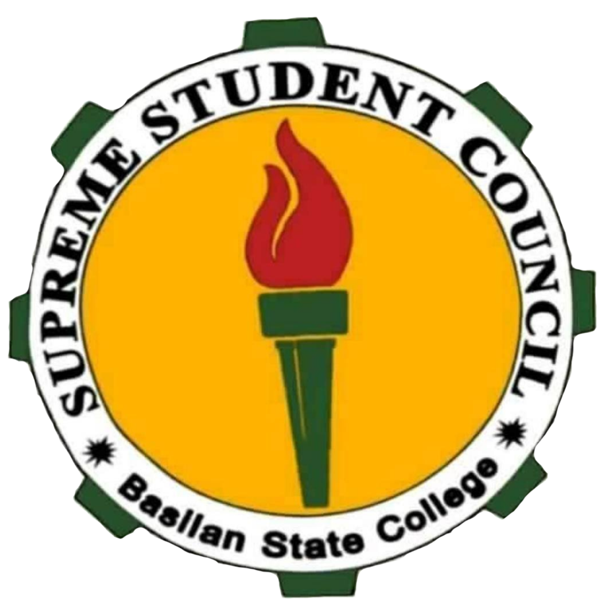

# 🎓 SSC Activity Hub

<p align="center">
  
</p>

<h3 align="center">
Official Digital Information Platform of the Supreme Student Council
</h3>

<p align="center">
  <b>Parageyan 2026</b><br>
  Basilan State College
</p>

<p align="center">


</p>


---

# 📌 About The Project

**SSC Activity Hub** is the official digital platform developed for the **Supreme Student Council (SSC) of Basilan State College** for **Parageyan 2026**.

The platform was created to provide students with a centralized and reliable source of information for all official SSC activities, competitions, announcements, schedules, and event-related updates.

Instead of depending on scattered social media posts, group messages, and separate announcements, SSC Activity Hub provides a unified digital environment where students can easily access verified information anytime and anywhere.


The system aims to improve:

- Student engagement
- Information accessibility
- Event participation
- Digital communication
- Student organization management


---

# 🎯 Project Vision

To establish a modern digital ecosystem for student activities by combining information management, interactive experiences, and future student-centered services into one platform.


---

# ✨ Core Features


## 🏠 Landing Page Experience

A modern and responsive homepage featuring:

- Parageyan 2026 introduction
- Hero section
- Event countdown timer
- College branding
- Interactive animations


---

## ⚡ Quick Access Navigation

Provides students immediate access to:

- Activities
- Event schedules
- Guidelines
- SSC information
- Announcements


---

## 🏛 SSC Information Center

Dedicated section for:

- Supreme Student Council introduction
- Leadership information
- Student services
- Organizational initiatives


---

# 🐾 College Spirit Identity

Interactive college representation system featuring:

- College identity cards
- Spirit animals
- Visual branding
- Animated presentation


Designed to strengthen:

- College pride
- Team identity
- Competition spirit


---

# 🎉 Activity Information System

Students can explore official Parageyan 2026 activities including:

- Event descriptions
- Activity details
- Important schedules
- Announcements


---

# 🗳 People Choice Award Voting System

An integrated digital voting platform allowing authenticated users to participate in official SSC voting activities.


Features:

- User authentication
- Candidate browsing
- Category-based voting
- Vote submission
- Duplicate vote prevention
- Already voted detection
- Voting status validation
- Responsive voting interface


---

# 👨‍💼 Admin Management System

Administrative tools for managing platform content.


Current capabilities:

- Candidate management
- Event management
- Category management
- Voting configuration
- User management
- Activity monitoring


---

# 📱 Responsive Design

Built for multiple devices:

✅ Desktop  
✅ Tablet  
✅ Mobile  


Students can access the platform anywhere with a consistent experience.


---

# 🛠 Technology Stack


| Technology | Purpose |
|---|---|
| Next.js | React framework with App Router |
| TypeScript | Type-safe development |
| Tailwind CSS | Modern responsive styling |
| Supabase | Authentication and database services |
| PostgreSQL | Data storage |
| Framer Motion | UI animations |
| Lucide Icons | Interface icons |
| shadcn/ui | Reusable components |


---

# 🏗 System Architecture


```
Frontend
   |
   |
Next.js App Router
   |
   |
Server Actions
   |
   |
Supabase
   |
   |
PostgreSQL Database
```


---

# 📁 Project Structure


```bash
ssc-activity-hub/

├── app/
│   ├── page.tsx
│   ├── voter/
│   ├── admin/
│   └── api/

├── components/
│   ├── landing/
│   ├── voter/
│   ├── admin/
│   └── ui/

├── hooks/
│
├── lib/
│   ├── supabase/
│   └── utils/

├── public/
│   ├── assets/
│   └── spirits/

├── package.json
├── next.config.js
├── tailwind.config.ts
├── tsconfig.json
└── README.md

```


---

# 🚀 Getting Started


## Requirements


Install:

- Node.js 18+
- npm / yarn / pnpm


Check versions:


```bash
node -v
npm -v
```


---

# 📦 Installation


Clone repository:


```bash
git clone https://github.com/yourusername/ssc-activity-hub.git
```


Navigate:


```bash
cd ssc-activity-hub
```


Install dependencies:


```bash
npm install
```


---

# ▶️ Development


Run development server:


```bash
npm run dev
```


Open:


```
http://localhost:3000
```


---

# 🏗 Production Build


Build:


```bash
npm run build
```


Start:


```bash
npm start
```


---

# 🌐 Deployment


Recommended platforms:


- Vercel
- Netlify
- Cloudflare Pages


Recommended setup:

```
Next.js + Vercel + Supabase
```


---

# 🔖 Version History


## v1.1.3 - Complete Voter Voting Flow

Released:

Features:

- Added voter server actions
- Added candidate fetching actions
- Added voter page integration
- Added vote submission flow
- Added already voted detection
- Added client-side vote state caching
- Added duplicate vote prevention
- Improved vote modal UX
- Added disabled state for completed votes


---

## v1.1.2

Admin management improvements.

Features:

- Admin dashboard
- Candidate management
- Event management


---

# 🔮 Future Roadmap


## v1.2.0

Planned:

- Live leaderboard
- Voting analytics
- Real-time vote monitoring
- Admin statistics dashboard


## v1.3.0

Planned:

- Student accounts
- Event registration
- Attendance tracking
- Digital certificates


## Future

- Notification system
- Media gallery
- Mobile application


---

# 👨‍💻 Developer


## Built By

**Jaymar Maruji**

Full Stack Developer


Specialization:

- Full Stack Web Development
- UI/UX Engineering
- Digital Information Systems
- Modern Web Applications


---

# 🏫 Project Ownership


**Project Owner**

Supreme Student Council  
Basilan State College


**Project Name**

SSC Activity Hub


**Event**

Parageyan 2026


**Development Year**

2026


---

# 🤝 Contribution


Contributions are welcome.


Create a feature branch:


```bash
git checkout -b feature/new-feature
```


Commit:


```bash
git commit -m "Add new feature"
```


Push:


```bash
git push origin feature/new-feature
```


Submit a Pull Request.


---

# 📄 License


MIT License


Copyright (c) 2026 Jaymar Maruji / Supreme Student Council


Permission is hereby granted, free of charge, to any person obtaining a copy
of this software and associated documentation files, to deal in the Software
without restriction.


THE SOFTWARE IS PROVIDED "AS IS", WITHOUT WARRANTY OF ANY KIND.


---

<p align="center">

Built with ❤️ for the students of Basilan State College

<br>

<b>Parageyan 2026</b>

</p>
